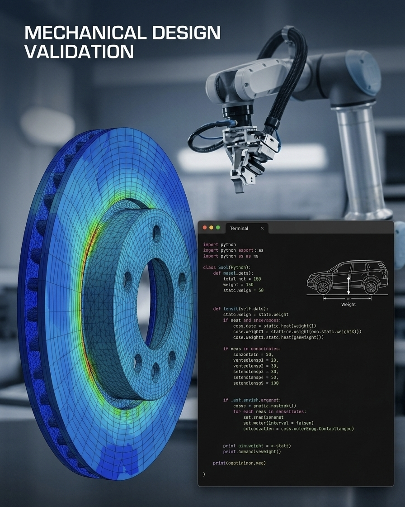

# automotive-brake-system-suite
Automotive Brake System Design, Simulation, and Optimization Suite

# Description:

A comprehensive engineering toolkit for vehicle brake system design sizing, thermal fatigue analysis, dynamic balance simulation, and tolerance stack-up verification.
```
automotive-brake-system-suite/
├── .github/
│   └── workflows/
│       └── ci-validation.yml
├── docs/
│   ├── DFMEA_Brake_System.pdf
│   └── DVP_Brake_Validation.pdf
├── src/
│   ├── __init__.py
│   ├── vehicle_dynamics.py
│   ├── thermal_analysis.py
│   └── tolerance_stack.py
├── tests/
│   ├── __init__.py
│   └── test_dynamics.py
├── requirements.txt
├── README.md
└── main.py
```
